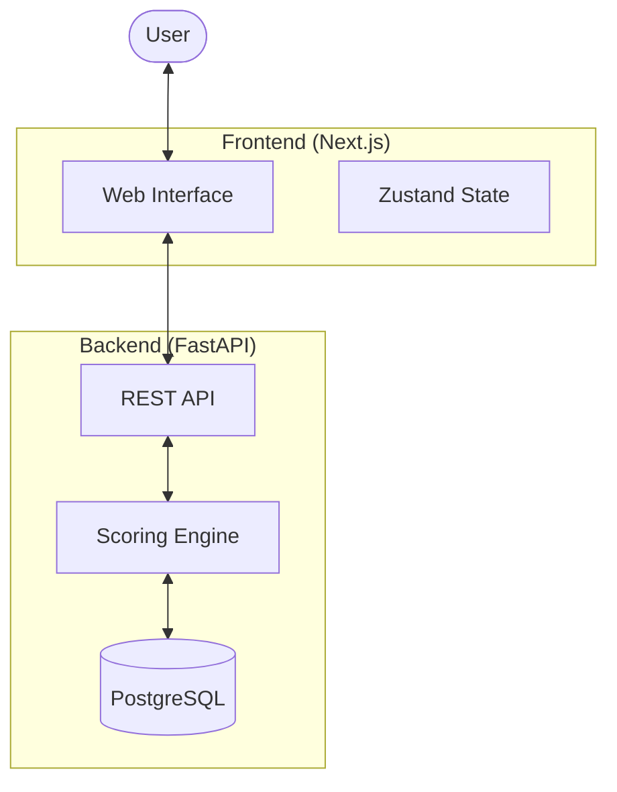

# 🐐 GOAT Arena

[](https://opensource.org/licenses/MIT)
[](https://github.com/fabishz/goat)
[](CONTRIBUTING.md)

**GOAT Arena** is a sophisticated, data-driven platform for ranking the "Greatest of All Time" across sports, music, and beyond. It combines objective historical data, era-normalization algorithms, expert analysis, and weighted fan sentiment to provide the most definitive rankings in the world.

---

## 🏗️ Architecture

The project is split into a modern Next.js frontend and a robust FastAPI backend.



---

## ✨ Key Features

- **🧮 Deterministic Scoring Engine**: Multi-factor models with era normalization.
- **⏳ Contextual Fairness**: Z-score dominance adjustments to compare legends across different eras.
- **🧠 Expert Voting System**: Verified subject matter experts with weighted influence.
- **🗳️ Trusted Fan Voting**: Anti-abuse protection and trust-based weighting for community sentiment.
- **🤖 AI Influence Analysis**: Traceable influence scores based on historical impact events.
- **📱 Premium Experience**: Modern, responsive UI with sleek animations and real-time updates.

---

## 🛠️ Tech Stack

### Frontend ([goat-arena-nextjs](goat-arena-nextjs/))
- **Framework**: Next.js 15+ (App Router)
- **Styling**: Tailwind CSS & Framer Motion
- **State Management**: Zustand & React Query
- **UI Components**: Radix UI (via shadcn/ui)

### Backend ([goat-backend](goat-backend/))
- **Framework**: FastAPI (Python 3.10+)
- **Database**: PostgreSQL with SQLAlchemy 2.0
- **Migrations**: Alembic
- **Validation**: Pydantic v2

---

## 🚀 Quick Start

### Prerequisites
- Node.js 18+ & npm
- Python 3.10+
- PostgreSQL

### 📥 Installation

1. **Clone the repository**
   ```bash
   git clone https://github.com/fabishz/goat.git
   cd goat
   ```

2. **Setup Backend**
   ```bash
   cd goat-backend
   python -m venv venv
   source venv/bin/activate  # On Windows: venv\Scripts\activate
   pip install -r requirements.txt
   # Configure .env based on .env.example
   alembic upgrade head
   uvicorn app.main:app --reload
   ```

3. **Setup Frontend**
   ```bash
   cd ../goat-arena-nextjs
   npm install
   # Configure .env.local
   npm run dev
   ```

Visit `http://localhost:3000` to see the application in action!

---

## 📁 Project Structure

```text
goat/
├── goat-arena-nextjs/   # Next.js Frontend Application
│   ├── app/             # Application Router Pages
│   ├── components/      # UI & Specialized Components
│   └── lib/             # Utilities & Mock Data
├── goat-backend/        # FastAPI Backend Engine
│   ├── app/             # API, Services & Models
│   ├── alembic/         # Database Migrations
│   └── tests/           # Comprehensive Test Suite
├── README.md            # Root Documentation (this file)
├── LICENSE              # Project License
└── SECURITY.md          # Security & Reporting Policy
```

---

## 🤝 Contributing

Contributions are what make the open source community such an amazing place to learn, inspire, and create. Any contributions you make are **greatly appreciated**.

Please see [CONTRIBUTING.md](CONTRIBUTING.md) for details on our code of conduct and the process for submitting pull requests.

---

## 🛡️ Security

We take security seriously. Please see our [SECURITY.md](SECURITY.md) for reporting instructions.

---

## 📄 License

Distributed under the MIT License. See [LICENSE](LICENSE) for more information.

*Built with ❤️ for the GOAT community.*
